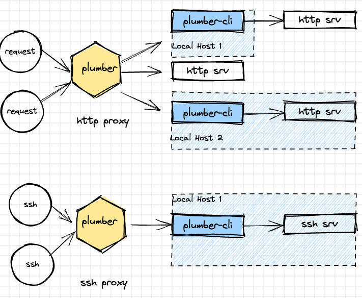

<p align="center">
    
</p>

`plumber` is a tunnel for expose localhost http and ssh server.
<p align="center">
    
</p>

## install
```
git clone git@github.com:lpxxn/plumber.git
cd plumber
make install
```
## quick start

## http tunnel
`Plumber` can forward HTTP request to a specified local service, and can also forward different requests to different services through configuration. For example, forward `/api/v1/user` to `Srv1` and forward all requests of `/query/*` to `Srv2`. It also supports parameter forwarding, such as forwarding `/order/:orderID` to `Srv3`
<p align="center">
    
</p>

eg:    
server config:
```yaml
tcpAddr: :9870

httpProxy:
  - domain: lpxxn.com
    port: 9190
    defaultForwardTo: lpxxn # forward to client which uuid is lpxxn
    forwards: # if forwards is empty, then all requests will be forwarded to defaultForwardTo
      - path: /api/*
        forwardTo: abc # forward to abc server
      - path: /order/:orderNO
        forwardTo: http://127.0.0.1:7632  # if forwardTo is not empty, then forward to the server which name is forwardTo

```
`plumber -config ./config/testdata/srv.yaml`

client config1:
```yaml
srvTcpAddr: 127.0.0.1:9870
http:
  remotePort: 9190 # remote port, same as server config port
  uid: lpxxn
  localSrvAddr: 127.0.0.1:7654
```
`plumber-cli -config ./config/testdata/cli-http-proxy.yaml`    
client config2:
```yaml
srvTcpAddr: 127.0.0.1:9870
http:
  remotePort: 9190 # remote port, same as server config port
  uid: abc
  localSrvAddr: 127.0.0.1:7632

```
`plumber-cli -config ./config/testdata/cli-http-proxy2.yaml`

send curl request:
```shell
curl http://lpxxn.com:9190/api/v1/user
curl http://lpxxn.com:9190/abc
curl http://lpxxn.com:9190/order/123
```
<p align="center">
    
</p>

## ssh tunnel
you can expose your local ssh server to the public network through `Plumber`, and support multiple users.
<p align="center">
    
</p>

server config:
```yaml
tcpAddr: :9870

```
run `plumber -config ./config/testdata/srv-ssh.yaml`   
client config1:
```yaml
srvTcpAddr: 127.0.0.1:9870 # plumber server addr
ssh:
  srvPort: 7222 # ssh remote server port
  localSSHAddr: 127.0.0.1:7655 # local ssh server ad dr

```
run `plumber-cli -config ./config/testdata/cli.yaml`
<p align="center">
    
</p>
